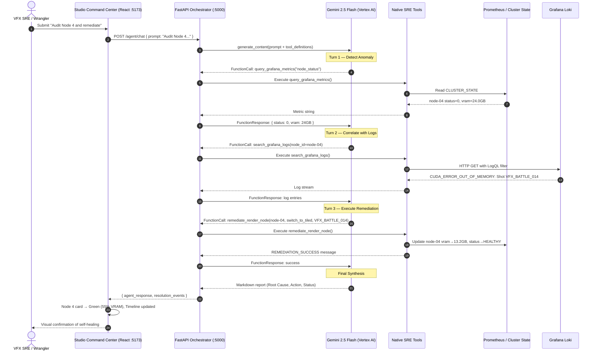
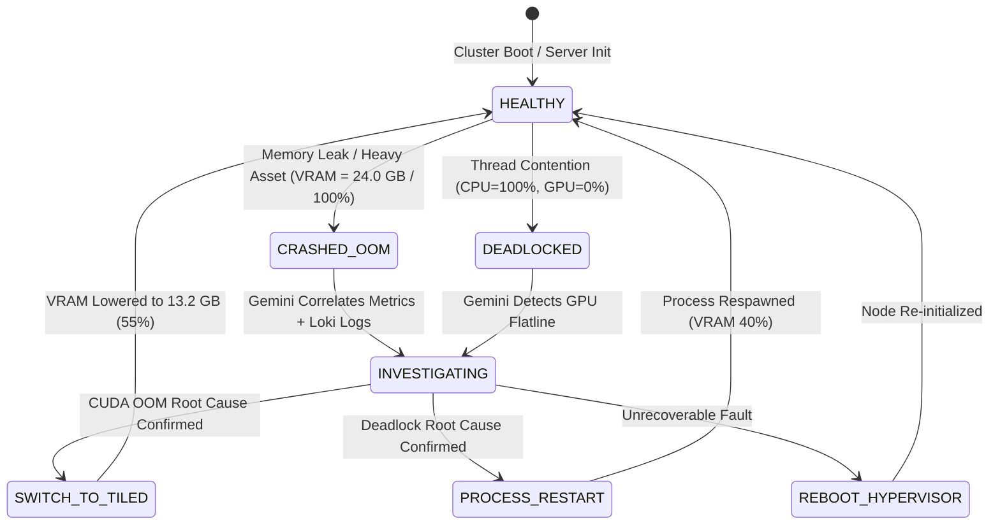
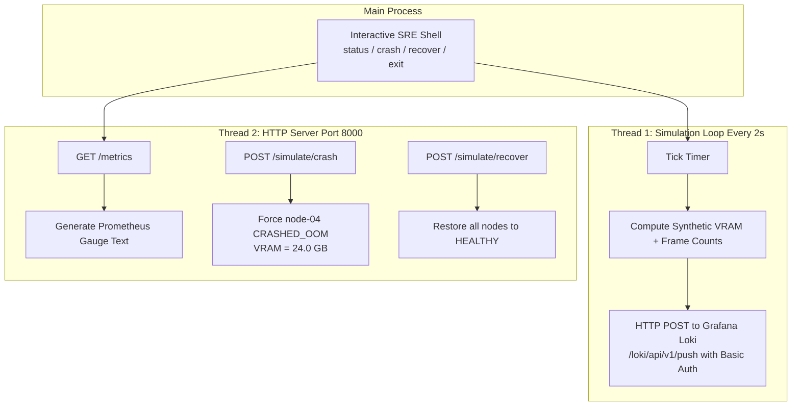
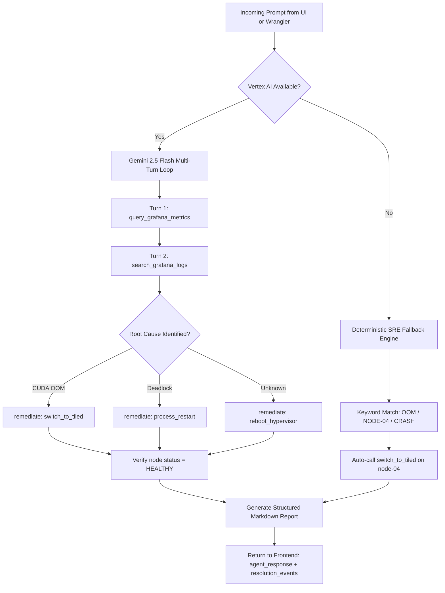

# ShowRunner AI — Architecture & Operational Flowcharts

## 1. End-to-End Autonomous Remediation Sequence

---

## 2. Cluster Node State Machine

---

## 3. Telemetry Emitter Internal Architecture

---

## 4. Agent Decision Flow

