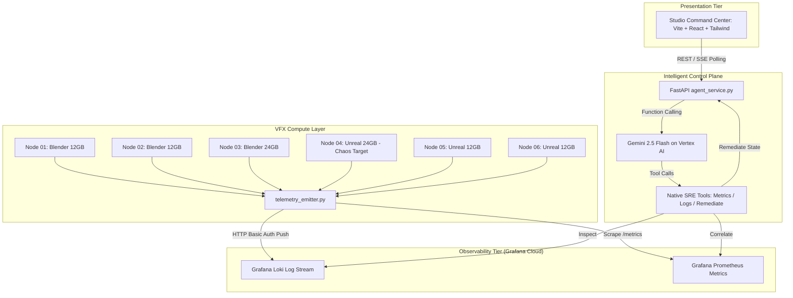

# ShowRunner AI — High-Level Design (HLD)

## 1. Executive Summary
**ShowRunner AI** is an autonomous Technical Director and Site Reliability Engineering (SRE) agent designed for visual effects (VFX) and 3D animation studios. In high-throughput render farm environments running Blender, Unreal Engine, and Arnold, memory exhaustion (CUDA Out-of-Memory / OOM) and worker deadlocks cause catastrophic delivery delays.

ShowRunner AI creates a self-healing operational loop: it continuously streams GPU metrics and frame logs into Grafana Cloud (Prometheus and Loki), uses **Google Gemini 2.5 Flash** on **Google Cloud Vertex AI** to detect and correlate telemetry anomalies, autonomously executes targeted remediations (such as transitioning heavy shots to Arnold tiled rendering), and provides real-time visibility to artists and supervisors through a React-based Studio Command Center.

---

## 2. Problem Statement & Operational Context
Modern cinematic VFX pipelines face critical infrastructure bottlenecks:
- **Catastrophic Failures at Scale**: A single 4K/8K frame exceeding GPU VRAM triggers a hard `CUDA_ERROR_OUT_OF_MEMORY`, dropping the worker node from the cluster and halting the queue.
- **Alert Fatigue & Delayed MTTR**: Human render wranglers must manually sift through gigabytes of raw render logs across hundreds of nodes to isolate root causes.
- **Resource Inefficiency**: Restarting failed frames without altering memory allocation parameters causes recurring crashes, wasting hours of compute time and thermal headroom.

---

## 3. System Architecture Topology

ShowRunner AI is divided into four decoupled tiers:
1. **Virtual VFX Render Cluster (`telemetry_emitter.py`)**:
   - Simulates 6 GPU worker nodes running Blender and Unreal Engine.
   - Pushes Prometheus gauges (`gpu_memory_used_bytes`, `node_status`) and structured application logs to Grafana Cloud Loki via HTTP Basic Authentication.
   - Exposes chaos injection endpoints (`/simulate/crash`, `/simulate/recover`) and an interactive CLI.
2. **Observability Data Fabric (Grafana Cloud)**:
   - **Grafana Loki**: Ingestion endpoint receiving frame render traces, warnings, and CUDA stack traces.
   - **Grafana Prometheus**: Scrapes GPU utilization and node operational states.
3. **Autonomous Agent Orchestrator (`agent_service.py`)**:
   - Built with **FastAPI** and powered by **Google Gemini 2.5 Flash** via the official `google-genai` SDK on **Google Cloud Vertex AI**.
   - Authenticates using Google Application Default Credentials (ADC) without requiring static API keys.
   - Hosts native tool definitions enabling Gemini to query Prometheus metrics, inspect Loki logs, and execute targeted node remediations.
   - Features a deterministic SRE solver fallback to guarantee 100% demo uptime under network degradation.
4. **Studio Command Center (`frontend/`)**:
   - Built with **React 18**, **Vite**, **Tailwind CSS**, and **Lucide React**.
   - Renders 6 dynamic GPU node health cards, live telemetry streams, an auto-refreshing Incident Resolution Timeline, and an interactive Director Console.

---

## Design Principles
- **Correlated Grounding**: Remediation is never executed on metric spikes alone. The agent must correlate a Prometheus status drop (node_status == 0) with a confirmed Loki error log signature (CUDA_ERROR_OUT_OF_MEMORY).
- **Least-Disruptive Remediation**: The agent prefers non-destructive configuration adaptations (e.g. switch_to_tiled rendering) over brute-force hypervisor reboots.
- **Fail-Safe Determinism**: If cloud latency or Vertex AI quotas are encountered during a live presentation, the system gracefully falls back to an embedded deterministic solver that replicates full reasoning.
- **Zero-Trust Cloud IAM**: The backend leverages Google Cloud ADC with workload identity concepts, preventing API key exposure.